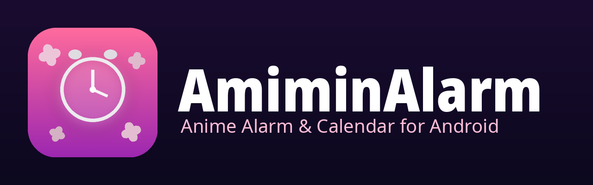
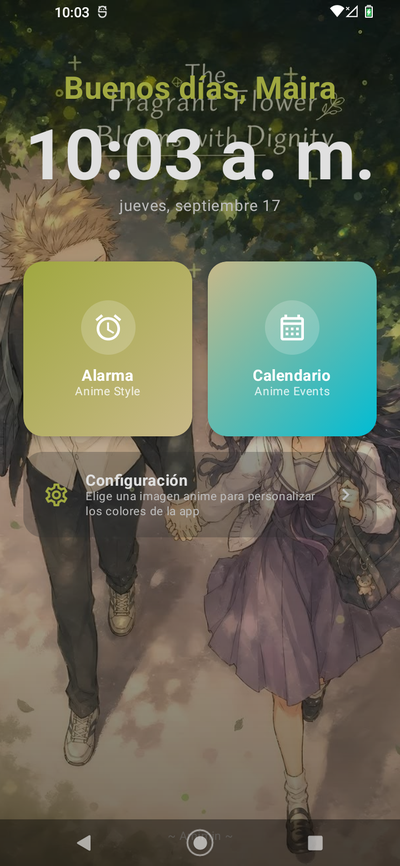
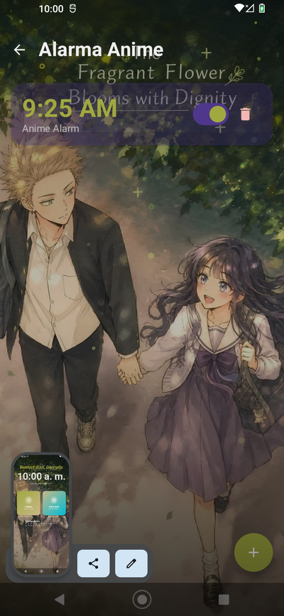
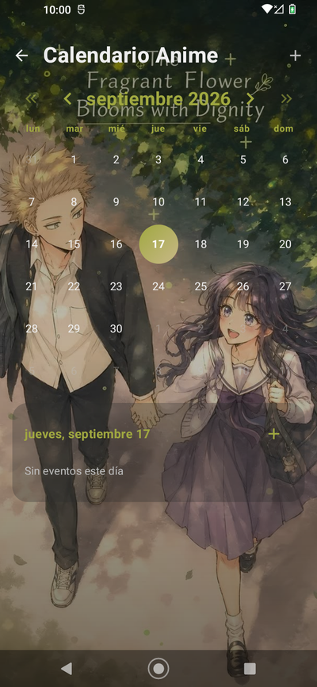
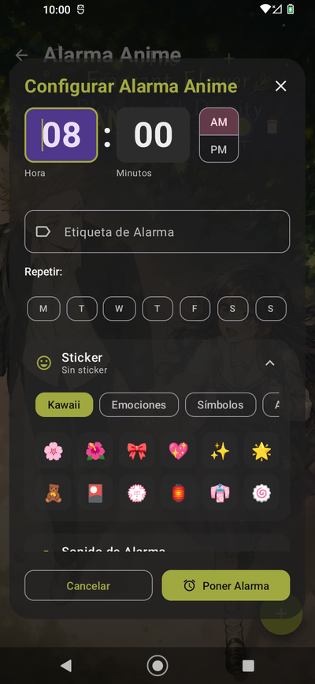
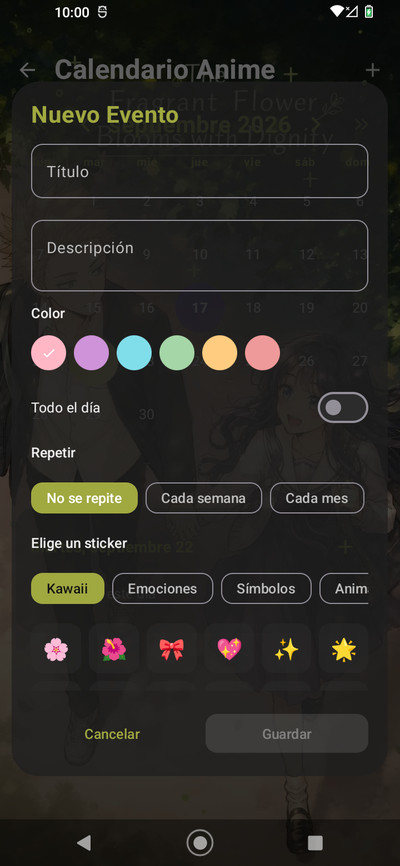
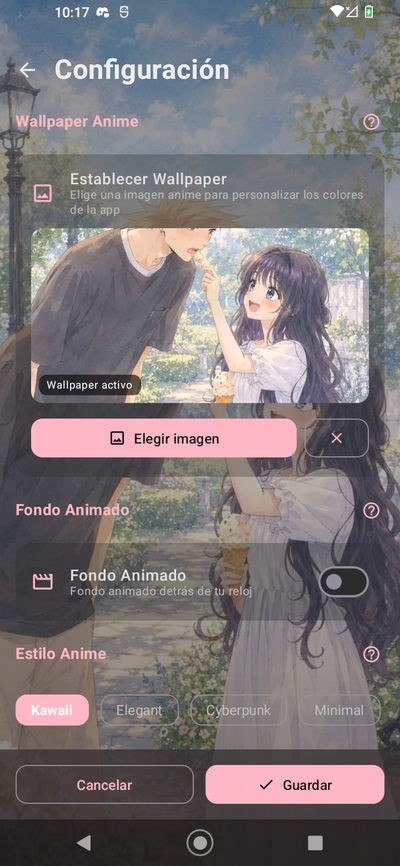
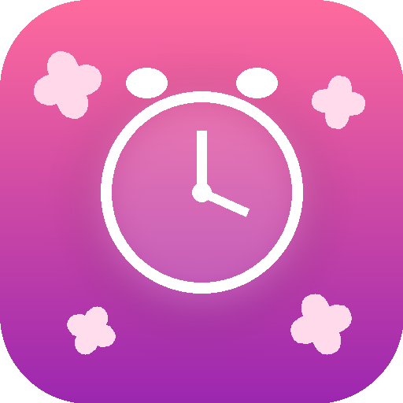

<p align="center">
  
</p>

<p align="center">
  <strong>Despertador y calendario con estilo anime: fondos animados, stickers, temas dinámicos y notificaciones que funcionan aunque la app esté cerrada.</strong>
</p>

<p align="center">
  
  
  
  
</p>

<p align="center">
  
  
  
  
</p>

---

## 📖 Descripción

**AmiminAlarm** es una aplicación Android nativa de **alarma y calendario** con una estética
anime cuidada al detalle. No es un despertador más: es una experiencia visual que se
adapta a ti, con **fondos animados**, **stickers**, **temas que se generan a partir de
tus imágenes** y notificaciones que **funcionan incluso con la app cerrada o el teléfono
bloqueado**.

Todo el proyecto está construido con **Kotlin + Jetpack Compose**, sin publicidad,
sin cuentas y **100% open source**.

---

## ✨ Características

### ⏰ Alarma
- **Alarma a pantalla completa** que suena aunque el teléfono esté bloqueado.
- **Recordatorios anticipados** configurables a **1 hora, 30 minutos y 10 minutos** antes.
- **Sonido personalizado**: elige entre los sonidos del sistema o **tu propio audio**.
- **Stickers anime** para cada alarma (5 categorías, 60 stickers).
- **Foto personalizada** por alarma.
- **Repetición por días** de la semana.
- **Posponer (snooze)** desde la notificación o la pantalla completa.
- **Fondo de pantalla de alarma personalizable**: animación sakura, tu imagen o tu video.

### 📅 Calendario
- Vista mensual con navegación **rápida por meses y años**.
- **Eventos con repetición**: semanal, mensual y anual.
- **Notificaciones de eventos** antes de que empiecen.
- **Stickers anime** y **colores personalizados** por evento.
- **Foto personalizada** por evento.

### 🎨 Personalización
- **Fondo de pantalla animado (Live Wallpaper)** con 5 modos:
  - **Degradado** — color que fluye suavemente
  - **Sakura** — pétalos de cerezo cayendo
  - **Estrellas** — cielo titilante
  - **Aurora** — ondas de aurora boreal
  - **Video** — **tu propio video** como fondo animado
- **Sonido on/off** para el fondo animado.
- **Temas de color**: 6 paletas predefinidas + colores personalizados + **colores
  extraídos automáticamente de tu wallpaper**.
- **5 estilos tipográficos anime**: Kawaii, Elegant, Cyberpunk, Minimal y Retro.
- **Modo claro y oscuro**.

### 🌍 Idiomas
Interfaz completa en **8 idiomas**, con **saludo según el país y la hora**:

| | | | |
|---|---|---|---|
| 🇪🇸 Español | 🇬🇧 English | 🇯🇵 日本語 | 🇰🇷 한국어 |
| 🇨🇳 中文 | 🇷🇺 Русский | 🇫🇷 Français | 🇩🇪 Deutsch |

> El saludo detecta el país: en **España** los tramos horarios son distintos
> (buenos días hasta las 14:00) que en **Latinoamérica** (buenos días hasta las 12:00).

### 👤 Perfil
- **Nombre de usuario** con el que la app te saluda cada vez que entras.
- **Formato de hora** configurable: **12 h (1:00 PM)** o **24 h (13:00)**.

### 💾 Copia de seguridad
- **Copia local**: genera el archivo `amiminalarm-copia-de-seguridad-AAAA-MM-DD.json`
  y tú eliges dónde guardarlo.
- **Copia en Google Drive** vía el selector del sistema.
- **Restaurar** alarmas, eventos, ajustes y wallpaper en cualquier teléfono.
- **Migraciones de base de datos** que **preservan tus datos** en cada actualización.

### 🔔 Notificaciones
- Canales separados para **alarma**, **recordatorios** y **eventos**.
- **Localizadas** en el idioma que hayas elegido.
- **Pantalla completa** sobre el bloqueo (full-screen intent).
- **Servicio en primer plano** para que el sonido no se corte.
- **Reagendado automático** tras reiniciar el teléfono.

---

## 📱 Capturas

<p align="center">
  
  &nbsp;
  
  &nbsp;
  
</p>
<p align="center">
  
  &nbsp;
  
  &nbsp;
  
</p>

<p align="center">
  <em>Wallpaper anime con colores extraídos automáticamente · stickers · fondos animados</em>
</p>

---

## ⬇️ Descarga

La forma más fácil de probar AmiminAlarm es descargar el APK firmado:

<p align="center">
  <a href="https://github.com/JonathanDevHurtado/AmiminAlarm/releases/latest">
    
  </a>
</p>

> **Requiere Android 8.0 (API 26) o superior.**
> Al instalar, activa «Instalar apps de origen desconocido» para tu navegador
> o gestor de archivos.

Si prefieres compilarlo tú mismo, consulta la sección
[Compilar y ejecutar](#-compilar-y-ejecutar).

---

## 🛠️ Tecnologías

| Capa | Tecnología |
|------|-----------|
| **Lenguaje** | Kotlin 1.9 |
| **UI** | Jetpack Compose · Material 3 |
| **Arquitectura** | MVVM + Clean Architecture (data / ui) |
| **Inyección de dependencias** | Hilt (Dagger) |
| **Persistencia** | Room (SQLite) · DataStore (Preferences) |
| **Navegación** | Navigation Compose |
| **Asincronía** | Coroutines · Flow |
| **Imágenes** | Coil · AndroidX Palette |
| **Video** | Media3 ExoPlayer |
| **Serialización** | Gson |
| **Build** | Gradle (Kotlin DSL) · AGP 8.2 |
| **Min SDK** | 26 (Android 8.0) |
| **Target SDK** | 34 (Android 14) |

---

## 🏗️ Arquitectura

AmiminAlarm sigue una arquitectura **MVVM** con separación clara por capas:

```
┌──────────────────────────────────────────────────────────┐
│                        UI (Compose)                       │
│   Screens  ·  ViewModels  ·  Theme  ·  Animations         │
└───────────────────────────┬──────────────────────────────┘
                            │ StateFlow / Flow
┌───────────────────────────▼──────────────────────────────┐
│                     Repositories                          │
│   AlarmRepository · CalendarRepository · SettingsRepository│
│                     BackupManager                         │
└───────────────────────────┬──────────────────────────────┘
                            │
┌───────────────────────────▼──────────────────────────────┐
│                        Data                               │
│   Room (Alarms, Events)  ·  DataStore (Ajustes)           │
│   AlarmScheduler  ·  Receivers  ·  Foreground Service     │
└──────────────────────────────────────────────────────────┘
```

**Puntos clave del diseño:**

- **Estado unidireccional**: los `ViewModel` exponen `StateFlow`, la UI solo observa.
- **AlarmScheduler** centraliza la programación con `AlarmManager` (exacta y con
  `setExactAndAllowWhileIdle`), los recordatorios y el snooze.
- **Foreground Service** (`AlarmService`) reproduce el sonido y muestra la notificación
  a pantalla completa, garantizando que suene en segundo plano y en bloqueo.
- **Migraciones incrementales** de Room que nunca destruyen datos del usuario.
- **Temas dinámicos**: los colores se derivan de la fuente activa (tema, personalizado,
  wallpaper o live wallpaper) y se propagan por `MaterialTheme`.

---

## 📂 Estructura del proyecto

```
AmiminAlarm/
├── app/
│   ├── src/main/
│   │   ├── java/com/amimin/app/
│   │   │   ├── MainActivity.kt              # Entrada + tema global
│   │   │   ├── AmiminApp.kt                 # Application + canales de notificación
│   │   │   ├── data/
│   │   │   │   ├── backup/BackupManager.kt  # Exportar / importar copia
│   │   │   │   ├── database/                # Room, DAOs, receivers, service
│   │   │   │   │   ├── AmiminDatabase.kt
│   │   │   │   │   ├── DatabaseMigrations.kt
│   │   │   │   │   ├── AlarmScheduler.kt
│   │   │   │   │   ├── AlarmService.kt
│   │   │   │   │   ├── AlarmReceiver.kt
│   │   │   │   │   ├── AlarmReminderReceiver.kt
│   │   │   │   │   ├── EventReminderReceiver.kt
│   │   │   │   │   ├── BootReceiver.kt
│   │   │   │   │   └── DAOs.kt
│   │   │   │   ├── model/Models.kt
│   │   │   │   └── repository/              # Repositorios + SettingsRepository
│   │   │   ├── di/DatabaseModule.kt         # Hilt
│   │   │   ├── notifications/               # Notificaciones localizadas
│   │   │   └── ui/
│   │   │       ├── animations/              # Partículas, live wallpaper, video
│   │   │       ├── components/              # StickerPicker, SoundEffects
│   │   │       ├── navigation/
│   │   │       ├── screens/
│   │   │       │   ├── home/                # Reloj, saludo, tarjetas
│   │   │       │   ├── alarm/               # Alarmas + pantalla de timbre
│   │   │       │   ├── calendar/            # Calendario + eventos
│   │   │       │   └── settings/            # Configuración
│   │   │       └── theme/                   # Color, Type, Shape, Theme
│   │   └── res/
│   │       ├── values/                      # Español (base)
│   │       ├── values-en/ ... values-zh/    # 8 idiomas
│   │       └── xml/                         # FileProvider, backup rules
│   └── build.gradle.kts
├── gradle/
├── docs/                                    # Documentación detallada
├── screenshots/
├── build.gradle.kts
├── settings.gradle.kts
├── gradle.properties
├── gradlew / gradlew.bat
├── README.md
├── LICENSE
├── CHANGELOG.md
├── CONTRIBUTING.md
├── CODE_OF_CONDUCT.md
└── SECURITY.md
```

---

## 🚀 Compilar y ejecutar

### Requisitos
- **Android Studio** Hedgehog (2023.1.1) o superior
- **JDK 17**
- **Android SDK 34**

### Pasos

```bash
# 1. Clona el repositorio
git clone https://github.com/JonathanDevHurtado/AmiminAlarm.git
cd AmiminAlarm

# 2. Configura el SDK (local.properties)
echo "sdk.dir=/ruta/a/tu/Android/Sdk" > local.properties

# 3. Compila el APK de debug
./gradlew assembleDebug

# 4. (Opcional) Instálalo en tu dispositivo conectado
./gradlew installDebug
```

El APK se genera en:
```
app/build/outputs/apk/debug/app-debug.apk
```

> Para una guía detallada consulta [`docs/04-compilar.md`](docs/04-compilar.md).

---

## 🧭 Documentación

| Documento | Contenido |
|-----------|-----------|
| [Arquitectura](docs/01-arquitectura.md) | Capas, flujo de datos y decisiones de diseño |
| [Estructura de archivos](docs/02-estructura.md) | Descripción de cada paquete y archivo |
| [Funcionalidades](docs/03-funcionalidades.md) | Detalle de cada característica |
| [Compilar](docs/04-compilar.md) | Guía de build paso a paso |
| [Alarmas y notificaciones](docs/05-alarmas.md) | Cómo funcionan AlarmManager y el servicio |
| [Temas y personalización](docs/06-temas.md) | Sistema de temas, wallpaper y colores |

---

## 🗺️ Roadmap

- [x] Alarma con pantalla completa y snooze
- [x] Calendario con eventos y repetición
- [x] Live wallpaper (degradado, sakura, estrellas, aurora, video)
- [x] Temas dinámicos desde wallpaper
- [x] 8 idiomas con saludo por país
- [x] Copia de seguridad local y en la nube
- [ ] Widget de escritorio
- [ ] Integración con Google Calendar
- [ ] Modo tableta / plegable
- [ ] Publicación en F-Droid

---

## 🤝 Contribuir

¡Las contribuciones son bienvenidas! Lee [`CONTRIBUTING.md`](CONTRIBUTING.md) para
empezar. En resumen:

1. Haz un **fork** del proyecto.
2. Crea una rama: `git checkout -b feature/mi-mejora`.
3. Haz commit: `git commit -m "Añade mi mejora"`.
4. Push: `git push origin feature/mi-mejora`.
5. Abre un **Pull Request**.

---

## 🔒 Seguridad

Si encuentras una vulnerabilidad, **no abras un issue público**. Consulta
[`SECURITY.md`](SECURITY.md) para el proceso de reporte responsable.

---

## 📄 Licencia

Este proyecto está bajo la **Licencia MIT**. Ver [`LICENSE`](LICENSE) para más detalles.

```
Copyright (c) 2026 Jonathan Hurtado
```

---

## 👤 Autor

<table>
  <tr>
    <td align="center">
      <a href="https://github.com/JonathanDevHurtado">
        <br/>
        <b>Jonathan Hurtado</b>
      </a><br/>
      <sub>Desarrollador Android</sub>
    </td>
  </tr>
</table>

- **GitHub:** [@JonathanDevHurtado](https://github.com/JonathanDevHurtado)
- **Email:** [JonathanHurtadoDev@proton.me](mailto:JonathanHurtadoDev@proton.me)

---

<p align="center">
  
</p>

<p align="center">
  Hecho con ❤️, Kotlin y Jetpack Compose
</p>
